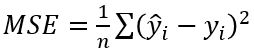

Tuatara Challenge
========================================================
author: Konrad Więcko
css: myStyles.css
date: 27.11.2016
autosize: true

Temat projektu
========================================================
transition: rotate
transition-speed: slow
class: normalSlide

Próba predykcji kwoty odszkodowania na podstawie danych udostępnionych przez firmę Allstate w serwisie kaggle.com

https://www.kaggle.com/c/allstate-claims-severity

Plan prezentacji
========================================================
type: prompt
class: normalSlide

- Założenia projektowe
- Schemat wykorzystanej infrastruktury obliczeniowej
- Wstępne manipulacje danymi
- Pierwsza próba uczenia maszynowego
- Próba poprawienia predykcji
- Podsumowanie projektu

Założenia projektowe
========================================================
class: normalSlide

- Wykorzystanie Apache Flume'a do ładowania danych do Apache Hadoop'a
- Wykorzystanie Apache Spark'a do prostych manipulacji danymi oraz uczenia maszynowego (MLlib)
- Wykorzystanie R jako:
  - interfejsu do obsługi HDFS'a oraz SPARK'a (sparklyr)
  - narzędzia do bardziej złożonych manipulacji danymi
- Weryfikacja/próba optymalizacji modeli otrzymanych w Apache Spark'u
- Napisanie pakietu w R ułatwiającego pracę z danymi

Schemat wykorzystanej infrastruktury obliczeniowej
========================================================
class: normalSlide
- Klaster obliczeniowy (zarówno dla Hadoop'a jak i Spark'a) składał się się z 4 wirtualnych maszyn (narzędziem służącym do wirtualizacji był VirtualBox) 
 
 
 
 Schemat wykorzystanej infrastruktury obliczeniowej
========================================================
class: normalSlide
 Schemat przetwarzania danych:
  - Dane za pomocą Apache Flume'a były ładowane do HDFS
  - Dane za poprzez RStudio (sparklyr) były odczytywane z HDFS, ładowane do Apache Spark'a, a następnie do pamięci w celu wykonania określonych manipulacji
  - Dane po manipulacjach były ładowane do Apache Spark'a w celu przeprowadzenia na nich uczenia maszynowego
  - W celu weryfikacji dany były powtórnie ładowane do RStudio
  
Schemat wykorzystanej infrastruktury obliczeniowej
========================================================
class: normalSlide
  

Wstępne manipulacje danymi
========================================================
class: normalSlide
Ogólna charakterystyka danych:
  - Wartość odszkodowania miała rozkład log-normalny. Z tego względu zdecydowano się na przygotowanie dwóch przypadków zbioru danych:
    1. Zmienna `loss` pozostawiona bez zmian (`loss` osnaczało wysokość odszkodowania)
    2. Zmienna `loss` została zlogatyrmowana loss' = ln(`loss`)

Wstępne manipulacje danymi
========================================================
class: normalSlide

      

Wstępne manipulacje danymi
========================================================
class: normalSlide
Ogólna charakterystyka danych c.d.:
  - Zmienne generalnie nie mały rozkładów normalnych
  
   
    
 
 Wstępne manipulacje danymi
========================================================
class: normalSlide
Ogólna charakterystyka danych c.d.

  
    
    

 Wstępne manipulacje danymi
========================================================
class: normalSlide
  - Zmienne często były ze sobą mocno skorelowane
    

 Wstępne manipulacje danymi
========================================================
class: normalSlide
Po zapoznaniu się z danymi zaproponowana została następująca faktoryzacja zbioru danych:
  - przypadek 1. - mapowanie liter na cyfry/liczby indywidualnie - w skryptach oznaczane jako 'case1'
    
  - przypadek 2. - mapowanie liter na cyfry/liczby globalnie - w skryptach oznaczane jako 'case2'
    
    

 Uczenie maszynowe
========================================================
class: normalSlide

Algorytmy wykorzystane do uczenia maszynowego:
  - ml_generalized_linear_regression
  - ml_gradient_boosted_trees

Wszystkie modele były porównywane ze sobą przy wykorzystaniu:

 
 
 
 Ponadto modele z typu GLM porównywane były ze sobą za pomocą współczynnika AIC
 
  Uczenie maszynowe
========================================================
class: normalSlide
Pierwszy etap uczenia maszynowego został wykonany za pomocą biblioteki MLlib zgodnie ze schematem:

  Próba poprawienia predykcji
========================================================
class: normalSlide

Pierwsza iteracja uczenia maszynowego - R = 0.3

W celu poprawienia predykcji modeli:
  - Ze wszystkich zmiennych zostały wybrane zmienne, których korelacja ze zmienną `loss` była istotna statystycznie
  - Ze wszystkich zmiennych zostały wybrane zmienne, których korelacja ze zmienną `loss` była co najmniej słaba (współczynnik korelacji >= 0.1)
   - Ze wszystkich zmiennych skorelowanych co najmniej słabo ze zmienną `loss` zostały wybrane takie, których wzajemna korelacja nie przekraczała 0.15
   - Ze zbioru treningowego zostały usunięte obserwacje odstające (pozostawiono jedynie obserwacje mieszczące się w przedziale +- 2 odchylenia standardowe od średniej ln(`loss`))
   - modele XGB miały zadawaną różną głębokość drzewa
   
   Próba poprawienia predykcji
========================================================
class: normalSlide
Wykresy R^2 dla różnych modeli liniowych oraz zbiorów treningowych i testowych:

  Próba poprawienia predykcji
========================================================
class: normalSlide
Wpływ głębokości drzewa oraz zestawu danych na RMSE

  Próba poprawienia predykcji
========================================================
class: normalSlide
Próba wykorzystania algorytmów 'lasso' oraz 'ridge'

  Wnioski
========================================================
class: normalSlide
- Najmniejszym średnim błedem kwadratowym (po 'usunięciu' wartości odstających) charakteryzował się model XGB o maksymalnej głębokości drzewa równej 5,  trenowany na zbiorze 'case1' gdy loss' = ln(loss) oraz zmiennych silnie skorelowanych ze zmienną `loss`
- Wśród modeli liniowych najlepsze parametry osiągnął model trenowany na zbiozre 'case1' (po 'usunięciu' wartości odstających) oraz zmiennych silnie skorelowanych ze zmienną `loss`
- Najlepsze spośród modeli XGB oraz GLM osiągały zbliżóne wartości średniego błędu kwadratowego
- Metody lasso oraz ridge nie podniosły jakości modelu

  Problemy, które wystąpiły w czasie trwania projektu
========================================================
class: normalSlide
- problemy konfiguracyjne związane z programami: Apache Hadoop oraz Apache Spark
- problemy z zaawansowaną manipulacją danymi w Apache Spark

  Zdobyta wiedza
========================================================
class: normalSlide
- Podstawowe umiejętności z zakresu instalacji, konfiguracji oraz obsługi oprogramowania:
  - Apache Flume
  - Apache Hadoop
  - Apache Spark
  - sparklyr
- Poszerzenie wiedzy na temat regresji liniowej oraz wykorzystywanych metod optymalizacyjnych

  Dziękuję za uwagę
========================================================
type: prompt
class: normalSlide
